# Google Firebase Tutorial
*Tutorial for using Google Firebase realtime database from the Particle Photon or Electron using webhooks*

[Google Firebase] (https://firebase.google.com/) provides a number of features including analytics, but this tutorial will be using it to store data using its NoSQL realtime database feature. It is a great way to store data generated from your Particle Photon or Electron. You can start using it for free, and for small amounts of data, you may be able to use it for free forever!

Updates to this document are here: [https://github.com/rickkas7/firebase_tutorial] (https://github.com/rickkas7/firebase_tutorial).

**Updated March 18, 2017**: Added the *Using the Webhook body feature* section to describe how to store true numbers to be stored in Firebase. 

## Getting started

To get started, go to [https://firebase.google.com/] (https://firebase.google.com/) and click the **Get Started For Free** button. If you're not already logged into Google you might need to do that as well.


Use the **Create new project** button to create a new project. There can be multiple database tables in a single project; I used a single project for all of the examples in this tutorial called "test1."

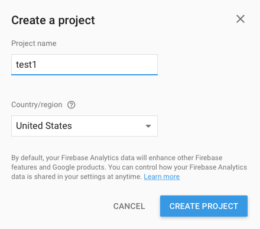

When you open the project, you'll mostly be interested in the Database view for this tutorial (the purple arrow). Also, you'll need your database URL later (the purple box).

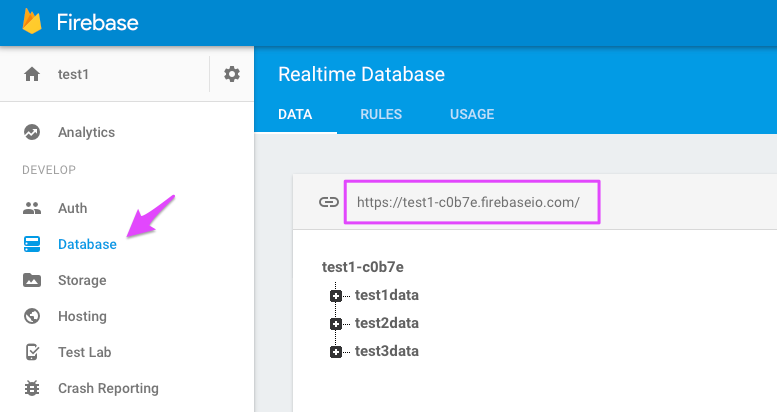


## Authenticating using an app secret

In this tutorial, we'll be authenticating using a database app secret. This means that all of the devices in your account share the same database access. This is generally quite reasonable for your own developer devices. 

App secrets are currently listed as deprecated but still work. An alternative is to use the [Google Cloud Integration](https://github.com/rickkas7/google_cloud_tutorial) which uses a more secure method of authentication. That tutorial has been updated with additional information for using it with Firebase.

For product webhooks, authentication of each user separately becomes a lot more complicated, so that will wait for another tutorial. 

When you create an app secret, Google says it is deprecated, but switching to the other method of authentication is quite a bit more complicated, and for now you can continue to use the app secret method.

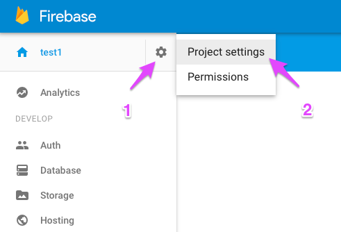

Select the gear icon (settings) in the upper left corner of the main window. It will expand with options and select **Project Settings**.

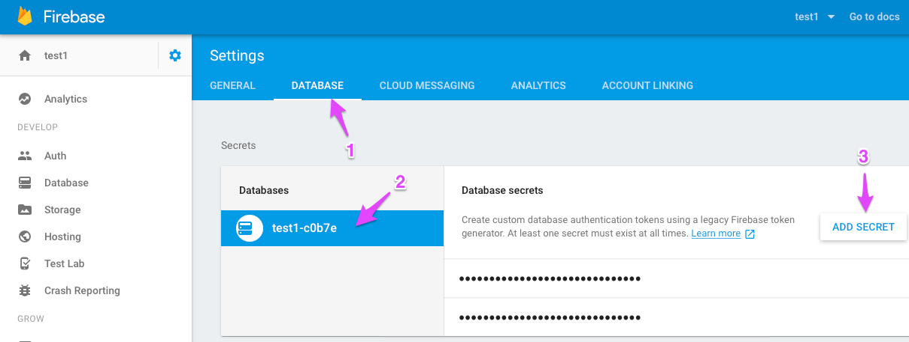

Then click **Database**, your database name (should already be selected) and then click **Add Secret**.

If you click on one of the obscured items, it will show the key and provide a way to copy it to the clipboard. You'll need this when you create your webhook.

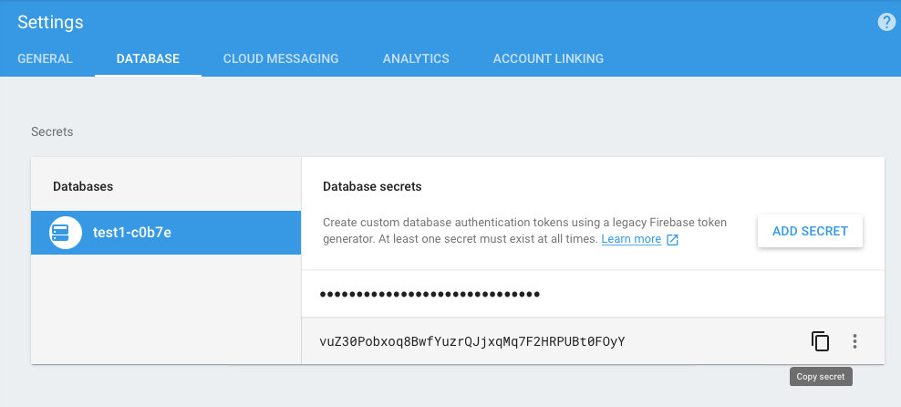

Keep these secret strings private; anyone with the string can read and write your database!


## Storing data in a table

One of the common uses will probably be to save sensor data in a database table. This is a great use of Firebase, and is easy to do, too.

### Creating the webhook

Here's my webhook definition. I saved this in a text file called hook.json. You can use the graphical webhook creator, but I prefer to create a file and use the Particle command line interface (CLI).

Note that you must update the "url" field as your hostname will be different, and also the "auth" field with your secret database key.

```
{
    "event": "test1data",
    "url": "https://test1-c0b7e.firebaseio.com/test1data/data.json",
    "requestType": "POST",
    "query": {
    	"auth":"vuZ30Pobxoq8BwfYuzrQJjxqMq7F2HRPUBt0FOyY"
    },
    "json": {
		"a": "{{a}}",
		"b": "{{b}}",
		"c": "{{c}}",
		"ts": "{{PARTICLE_PUBLISHED_AT}}"
    },
    "mydevices": true,
    "noDefaults": true
}

```

You can then create the webhook using the [Particle CLI] (https://particle.io/cli) and a command like:

```
particle webhook create hook.json
```

Creating a webhook from the CLI always creates a new webhook - it does not replace an existing one so make sure you delete the old one if you're editing a webhook, otherwise great confusion can result because both will run!

It's also possible to test the webhook from the command line:

```
particle publish test1data "{\"a\":1,\"b\":12.34,\"c\":123}"
```

Before running that command, it's a good idea to open up [https://console.particle.io] (https://console.particle.io) and then the logs tab. Running the publish command above should generate something like:

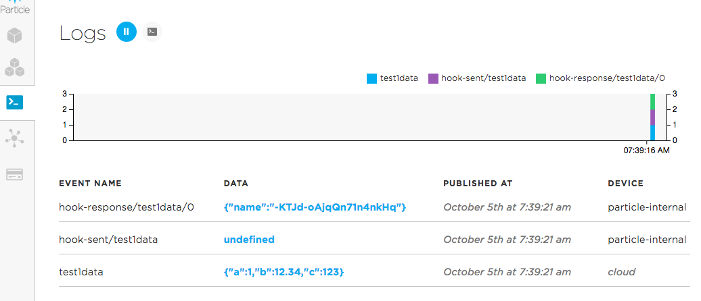

The event named "test1data" is the trigger. The "hook-sent" event indicates that the webhook was sent. The "hook-response/test1data" event is the response from the Firebase database server. The name string ("-KTJd-oAjqQn71n4nkHq") is a unique key from the database for the row that was created. Yours will be different.

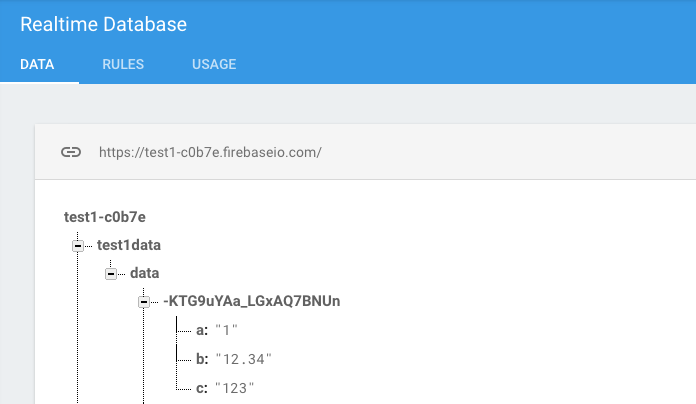

If you switch over to the Firebase database view, expand "test1data" and "data" and click on the unique database row identifier, you'll see the data that you wrote!

One problem with this webhook is that it stores all of the data as strings, not as true numbers. The section *Using the Webhook body feature* below explains how to get around this limitation.

### Photon or Electron code

Here's some code you can flash to a Photon or Electron:

```
#include "Particle.h"

// Test Program #1 for Firebase Integration
// Just generates some simple random data once a minute

#include <math.h> // This is just for cos and M_PI, used in generating random sample data

// Forward declarations
void publishData();

const unsigned long PUBLISH_PERIOD_MS = 60000;
const unsigned long FIRST_PUBLISH_MS = 5000;
const char *PUBLISH_EVENT_NAME = "test1data";

unsigned long lastPublish = FIRST_PUBLISH_MS - PUBLISH_PERIOD_MS;
int nextValue = 1;

void setup() {
	Serial.begin(9600);
}

void loop() {
	if (millis() - lastPublish >= PUBLISH_PERIOD_MS) {
		lastPublish = millis();
		publishData();
	}
}

void publishData() {
	// This just publishes some somewhat random data for testing

	// a is a monotonically increasing integer
	int a = nextValue++;

	// double value b is a cosine, so the values will rise and fall nicely over 360 steps
	double b = cos((double)(a % 360) * M_PI / 180.0);

	// c is a random integer
	int c = rand();

	char buf[256];
	snprintf(buf, sizeof(buf), "{\"a\":%d,\"b\":%.3f,\"c\":%d}", a, b, c);
	Serial.printlnf("publishing %s", buf);
	Particle.publish(PUBLISH_EVENT_NAME, buf, PRIVATE);
}

```

The program generates a "test1data" event, which will trigger the webhook. It just generates some dummy data, two integers and a float, but that's enough to see what it's doing.

The snprintf function is a little hard to read because C requires the double quote character to be escaped, but it really just generates a string that looks like this, a JSON object string:

```
{"a":5,"b":0.996,"c":812669700}
```

If you need a refresher on JSON, the data interchange format used extensively in Firebase and in webhooks, [this tutorial] (http://www.w3schools.com/json/) is pretty good.


### How the pieces connect together

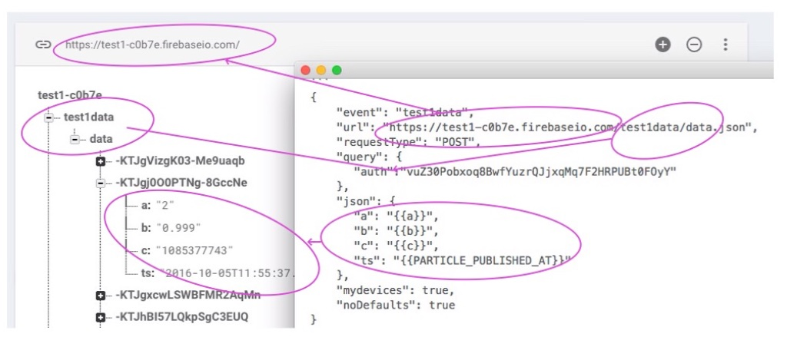

This diagram may help you figure out how the webhook fields map into the database.

The first part of the url maps into your database URL, displayed at the top of the Firebase database window.

The next part of the url maps into your database hierarchy. The URL always ends in something.json. In this case, it's data.json, which stores data in "data".

Not circled in the diagram, but the requestType is set to POST. This means that every time the webhook is run, a new row is created in the table. There are examples of using PUT and GET below. Since a new row is created each time, you see the unique keys like "-KTJgVizgK03-Me9uaqb".

Finally, the json section of the webhook defines what individual fields to include. This uses mustache templates, which are described in a separate [webhooks tutorial] (https://github.com/rickkas7/particle-webhooks).


## Firebase data structure

You should read the documentation about structuring your data efficiently in Firebase:

[https://firebase.google.com/docs/database/rest/structure-data] (https://firebase.google.com/docs/database/rest/structure-data)

Unlike a SQL database, there's no schema that strictly ties you to a specific format, but there are some things you should be careful of to make sure your data can be efficiently accessed.

## Storing data in a per-device table

That wasn't too bad, but all of the data was stored in a single table. What if you have multiple devices reporting data, and you want to store them separately. No problem!

Here's my webhook for per-device tables:

```
{
    "event": "test2data",
    "url": "https://test1-c0b7e.firebaseio.com/test2data/{{n}}.json",
    "requestType": "POST",
    "query": {
    	"auth":"vuZ30Pobxoq8BwfYuzrQJjxqMq7F2HRPUBt0FOyY"
    },
    "json": {
		"a": "{{a}}",
		"b": "{{b}}",
		"c": "{{c}}",
		"ts": "{{PARTICLE_PUBLISHED_AT}}"
    },
    "mydevices": true,
    "noDefaults": true
}

```

You'll notice that it's the same except for the URL:

Previous example:

```
https://test1-c0b7e.firebaseio.com/test1data/data.json
```

New, per-device example:

```
https://test1-c0b7e.firebaseio.com/test2data/{{n}}.json
```

The addition of the `{{n}}` in the URL allows the device to send up a JSON parameter n (name) that specifies where to store its data.

Here's the Photon code. It stores the device name in the n parameter.

```
#include "Particle.h"

// Test Program #2 for Firebase Integration
// Just generates some simple random data once a minute, stores in a per-device table
// using the device name as the key.

#include <math.h> // This is just for cos and M_PI, used in generating random sample data

// Forward declarations
void publishData();
void deviceNameHandler(const char *topic, const char *data);

const unsigned long PUBLISH_PERIOD_MS = 60000;
const unsigned long FIRST_PUBLISH_MS = 10000;
const char *PUBLISH_EVENT_NAME = "test2data";

unsigned long lastPublish = FIRST_PUBLISH_MS - PUBLISH_PERIOD_MS;
int nextValue = 1;
String deviceName;

void setup() {
	Serial.begin(9600);

	Particle.subscribe("spark/", deviceNameHandler);
	Particle.publish("spark/device/name");
}

void loop() {
	if (millis() - lastPublish >= PUBLISH_PERIOD_MS) {
		lastPublish = millis();
		if (deviceName.length() > 0) {
			publishData();
		}
	}
}

void publishData() {
	// This just publishes some somewhat random data for testing

	// a is a monotonically increasing integer
	int a = nextValue++;

	// double value b is a cosine, so the values will rise and fall nicely over 360 steps
	double b = cos((double)(a % 360) * M_PI / 180.0);

	// c is a random integer
	int c = rand();

	char buf[256];
	snprintf(buf, sizeof(buf), "{\"a\":%d,\"b\":%.3f,\"c\":%d,\"n\":\"%s\"}", a, b, c, deviceName.c_str());
	Serial.printlnf("publishing %s", buf);
	Particle.publish(PUBLISH_EVENT_NAME, buf, PRIVATE);
}

void deviceNameHandler(const char *topic, const char *data) {
	deviceName = data;
}
```

And here's what the data looks like in Firebase:

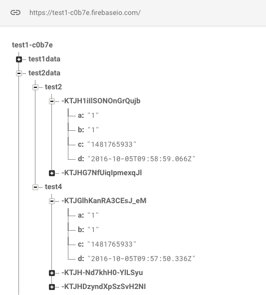

Under test2data, there are now separate keys for test2 and test4, which are the device names of the two devices that I used for testing here.

### Electron with device name and sleep

This code for the Electron is more complicated, but stores the device name in retained memory so it doesn't need to be retrieved every time, saving data. It also sleeps between publishes. 

```
#include "Particle.h"

// Test Program #4 for Firebase Integration
// Similar to #2, but optimized for the Electron. Goes to sleep between samples.
// Just generates some simple random data once a minute, stores in a per-device table
// using the device name as the key.
STARTUP(System.enableFeature(FEATURE_RETAINED_MEMORY));

#include <math.h> // This is just for cos and M_PI, used in generating random sample data

SYSTEM_THREAD(ENABLED);

// Forward declarations
void publishData();
void deviceNameHandler(const char *topic, const char *data);

const unsigned long POST_CONNECT_WAIT_MS = 8000;
const unsigned long NAME_WAIT_MS = 20000;
const unsigned long POST_PUBLISH_WAIT_MS = 2000;
const unsigned long MAX_CONNECT_TIME_MS = 120000;
const unsigned long SLEEP_TIME_SEC = 3600;
const char *PUBLISH_EVENT_NAME = "test2data";

const uint32_t RETAINED_DATA_MAGIC = 0xa2c7206a;
const size_t DEVICE_NAME_MAX_LEN = 31;
typedef struct {
	uint32_t magic;
	char deviceName[DEVICE_NAME_MAX_LEN + 1];
} RetainedData;

enum State {
	START_STATE,
	CONNECTED_WAIT_STATE,
	POST_CONNECT_WAIT_STATE,
	GET_NAME_STATE,
	NAME_WAIT_STATE,
	PUBLISH_STATE,
	POST_PUBLISH_WAIT_STATE,
	SLEEP_STATE
};

retained RetainedData retainedData = {0};

int nextValue = 1;
State state = START_STATE;
unsigned long stateTime = 0;

void setup() {
	Serial.begin(9600);

}

void loop() {
	switch(state) {
	case START_STATE:
		state = CONNECTED_WAIT_STATE;
		stateTime = millis();
		break;

	case CONNECTED_WAIT_STATE:
		if (Particle.connected()) {
			Serial.println("connected to the cloud");
			state = POST_CONNECT_WAIT_STATE;
		}
		else
		if (millis() - stateTime >= MAX_CONNECT_TIME_MS) {
			// Failed to connect to the cloud, go to sleep and try again later
			Serial.println("failed to connect to cloud");
			state = SLEEP_STATE;
		}
		break;

	case POST_CONNECT_WAIT_STATE:
		if (millis() - stateTime >= POST_CONNECT_WAIT_MS) {
			state = GET_NAME_STATE;
		}
		break;

	case GET_NAME_STATE:
		if (retainedData.magic != RETAINED_DATA_MAGIC || retainedData.deviceName[0] == 0) {
			memset(&retainedData, 0, sizeof(retainedData));
			retainedData.magic = RETAINED_DATA_MAGIC;

			Particle.subscribe("spark/", deviceNameHandler);
			Particle.publish("spark/device/name");
			state = NAME_WAIT_STATE;
			stateTime = millis();
		}
		else {
			Serial.printlnf("device name in retained memory %s", retainedData.deviceName);
			state = PUBLISH_STATE;
			stateTime = millis();
		}
		break;

	case NAME_WAIT_STATE:
		if (retainedData.deviceName[0] != 0) {
			Serial.printlnf("device name from cloud %s", retainedData.deviceName);
			state = PUBLISH_STATE;
			stateTime = millis();
		}
		else
		if (millis() - stateTime >= NAME_WAIT_MS) {
			// Failed to connect to the cloud, go to sleep and try again later
			Serial.println("failed to get device name");
			state = SLEEP_STATE;
		}
		break;


	case PUBLISH_STATE:
		publishData();

		state = POST_PUBLISH_WAIT_STATE;
		stateTime = millis();
		break;

	case POST_PUBLISH_WAIT_STATE:
		if (millis() - stateTime >= POST_PUBLISH_WAIT_MS) {
			state = SLEEP_STATE;
		}
		break;

	case SLEEP_STATE:
		Serial.printlnf("going to sleep for %d seconds", SLEEP_TIME_SEC);

		// This delay is just so you can see the serial print go out, feel free to remove if desired
		delay(250);

		System.sleep(SLEEP_MODE_DEEP, SLEEP_TIME_SEC);

		// Not reached; when waking up from SLEEP_MODE_DEEP, the code starts again from setup()
		break;

	}
}

void publishData() {
	// This just publishes some somewhat random data for testing

	// a is a monotonically increasing integer
	int a = nextValue++;

	// double value b is a cosine, so the values will rise and fall nicely over 360 steps
	double b = cos((double)(a % 360) * M_PI / 180.0);

	// c is a random integer
	int c = rand();

	char buf[256];
	snprintf(buf, sizeof(buf), "{\"a\":%d,\"b\":%.3f,\"c\":%d,\"n\":\"%s\"}", a, b, c, retainedData.deviceName);
	Serial.printlnf("publishing %s", buf);
	Particle.publish(PUBLISH_EVENT_NAME, buf, PRIVATE);
}

void deviceNameHandler(const char *topic, const char *data) {
	if (strlen(data) <= DEVICE_NAME_MAX_LEN) {
		strcpy(retainedData.deviceName, data);
	}
	else {
		// Truncate name
		strncpy(retainedData.deviceName, data, DEVICE_NAME_MAX_LEN);
		retainedData.deviceName[DEVICE_NAME_MAX_LEN] = 0;
	}
}
```


## Using Firebase for persistent variables

Sometimes you don't want a historical account of all of the values you've ever had, you only need to know the most recent value. 

This example shows how you can use Firebase to exchange values from one device to another. This technique is handy when the devices may not be running at the same time, because they use the sleep function to save battery power, for example.

### Saving data to Firebase

Here's the webhook for the data sender:

```
{
    "event": "test3sdata",
    "url": "https://test1-c0b7e.firebaseio.com/test3data/data.json",
    "requestType": "PUT",
    "query": {
    	"auth":"vuZ30Pobxoq8BwfYuzrQJjxqMq7F2HRPUBt0FOyY"
    },
    "json": {
		"a": "{{a}}",
		"b": "{{b}}",
		"c": "{{c}}",
		"ts": "{{PARTICLE_PUBLISHED_AT}}"
    },
    "mydevices": true,
    "noDefaults": true
}
```

The main difference here is that the requestType is PUT, not POST. The PUT method doesn't create a table of values; it just creates a single element to hold the data, overwriting any previous data at that location.

This is what the data looks like in Firebase:

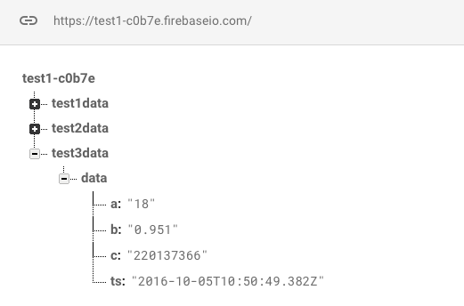

Note that lack of unique keys.

And the code, which is nearly identical to the previous example.

```
#include "Particle.h"

// Test Program #3 for Firebase Integration
// Just generates some simple random data once a minute

#include <math.h> // This is just for cos and M_PI, used in generating random sample data

// Forward declarations
void publishData();

const unsigned long PUBLISH_PERIOD_MS = 60000;
const unsigned long FIRST_PUBLISH_MS = 5000;
const char *PUBLISH_EVENT_NAME = "test3sdata";

unsigned long lastPublish = FIRST_PUBLISH_MS - PUBLISH_PERIOD_MS;
int nextValue = 1;

void setup() {
	Serial.begin(9600);
}

void loop() {
	if (millis() - lastPublish >= PUBLISH_PERIOD_MS) {
		lastPublish = millis();
		publishData();
	}
}

void publishData() {
	// This just publishes some somewhat random data for testing

	// a is a monotonically increasing integer
	int a = nextValue++;

	// double value b is a cosine, so the values will rise and fall nicely over 360 steps
	double b = cos((double)(a % 360) * M_PI / 180.0);

	// c is a random integer
	int c = rand();

	char buf[256];
	snprintf(buf, sizeof(buf), "{\"a\":%d,\"b\":%.3f,\"c\":%d}", a, b, c);
	Serial.printlnf("publishing %s", buf);
	Particle.publish(PUBLISH_EVENT_NAME, buf, PRIVATE);
}
```

In fact, other than the event name, it is identical. The determination of whether to add new unique rows or overwrite is part of the webhook definition, not the Photon/Electron code.


### Reading data from Firebase

For the receiver of the data, here's the webhook definition:

```
{
    "event": "test3rdata",
    "url": "https://test1-c0b7e.firebaseio.com/test3data/data.json",
    "requestType": "GET",
    "query": {
    	"auth":"vuZ30Pobxoq8BwfYuzrQJjxqMq7F2HRPUBt0FOyY"
    },
    "mydevices": true,
    "noDefaults": true
}
```

The main difference from the other examples is that the requestType is GET and there is no json section. This is typically for using GET.

The code for the receiver looks like this:

```
#include "Particle.h"

// Test Program #3 for Firebase Integration
// Reads data from the database and prints it to the debug serial port

// Requires the SparkJson library:
// https://github.com/menan/SparkJson
#include "SparkJson/SparkJson.h"

// Forward declarations
void getDataHandler(const char *topic, const char *data);


const unsigned long CHECK_PERIOD_MS = 60000;
const unsigned long FIRST_CHECK_MS = 5000;
const char *CHECK_EVENT_NAME = "test3rdata";

unsigned long lastPublish = FIRST_CHECK_MS - CHECK_PERIOD_MS;
int nextValue = 1;

void setup() {
	Serial.begin(9600);
	Particle.subscribe("hook-response/test3rdata", getDataHandler, MY_DEVICES);
}

void loop() {
	if (millis() - lastPublish >= CHECK_PERIOD_MS) {
		lastPublish = millis();

		Particle.publish(CHECK_EVENT_NAME, "", PRIVATE);
	}
}

void getDataHandler(const char *topic, const char *data) {
	// This isn't particularly efficient; there are too many copies of the data floating
	// around here, but the data is not very large and it's not kept around long so it
	// should be fine.
	StaticJsonBuffer<256> jsonBuffer;
	char *mutableCopy = strdup(data);
	JsonObject& root = jsonBuffer.parseObject(mutableCopy);
	free(mutableCopy);

	// Serial.printlnf("data: %s", data);

	// Because of the way the webhooks work, all data, including numbers, are represented as
	// strings, so we need to convert them back to their native data type here
	int a = atoi(root["a"]);
	float b = atof(root["b"]);
	int c = atoi(root["c"]);

	Serial.printlnf("a=%d b=%.3f c=%d", a, b, c);
}
```

Since the data returned by Firebase is in JSON format I used the [SparkJson library] (https://github.com/menan/SparkJson) which is in the community libraries in Particle Build (Web IDE) as SparkJson.

You could manually parse the result, or use Mustache response templates to extract only the data you want, but in this case I chose to use the library.

Whenever the code wants to retrieve the current value from Firebase, it posts an event "test3rdata" that triggers a webhook to get the value from Firebase, then returns the data to the Photon/Electron.

The serial output might look like this:

```
a=15 b=0.966 c=2105754108
a=16 b=0.961 c=182546393
```

And this is what the Particle console would look like:

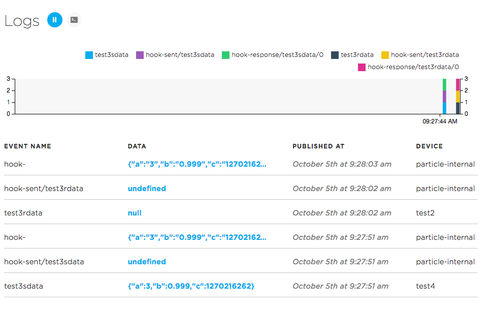

## Using the Webhook body feature

One of the problems with the first example above is that every field in the database is a string. Sometimes you want the fields to be actual numbers, which makes processing them and doing calculations much easier. This isn't possible using the json feature of webhooks, but it is possible using body.

Here's a webhook using body:

```
{
    "event": "test1data",
    "url": "https://test1-c0b7e.firebaseio.com/test1data/data.json",
    "requestType": "POST",
    "headers": {
    	"Content-Type":"application/json"
    },
    "query": {
    	"auth":"vuZ30Pobxoq8BwfYuzrQJjxqMq7F2HRPUBt0FOyY"
    },
    "body":"{\"a\":{{a}}, \"b\":{{b}}, \"c\":{{c}}, \"ts\":\"{{PARTICLE_PUBLISHED_AT}}\" }", 
    "mydevices": true,
    "noDefaults": true
}
```

And the data that shows up in the Firebase console. Note that the numbers are not surrounded by double quotes here:

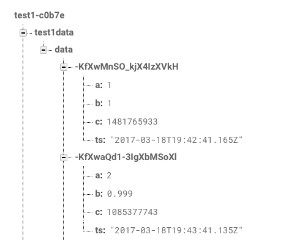

The body feature is complicated enough that you should read the section on it in the [webhooks intermediate tutorial](https://github.com/rickkas7/particle-webhooks).


